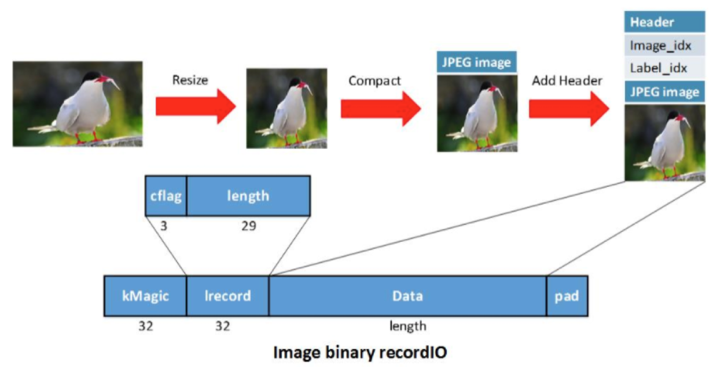

# SageMaker Demo

## **Introduction:**

Amazon SageMaker  is a fully-managed service that enables developers and data scientists to quickly and easily build, train, and deploy machine learning models at any scale. Amazon SageMaker removes all the barriers that typically slow down developers who want to use machine learning.

In this demo, I will be demonstration a very interesting concept in deep learning called &quot; **Transfer Learning**&quot;. Transfer learning is a very popular approach that uses pre-trained deep learning models as a starting point for other DL models to exploit the improvement in some tasks like speech recognition and computer vision. Training a model can be an expensive and time-consuming process and there is a lot of learning gathered as an output of this process. Therefore, you will use a pre-trained DL model (ResNet-50) to transfer learning to a new recognizer model.

## **Dataset format:**

Data loading is an important part of any machine learning system. When we work with tiny datasets, we can get away with loading an entire dataset into GPU memory. With larger datasets, we must store examples in main memory. And when datasets grow too large to fit into main memory, data loading can become performance-critical. We will use RecordIO format to resize and compact the images then load our dataset efficiently.



## **Solution Overview:**

You will build a deep learning model that recognizes different flower species from a 102 different categories. You will build, train and deploy the model using Amazon Sagemaker, MXNet Framework and the Oxford 102-Flower Category Dataset.

#### NOTE: I will be using Oregon (us-west-2) region for the demo

## **Step1 (Model Training):**

Log in the AWS Console -&gt; Navigate to **Amazon SageMaker** -&gt; on the left hand side, click on **Notebook Instances**. You will see a stopped notebook called **&quot;Sagemaker-Demo-SydSummit&quot;**.  Select the notebook instance and click on &quot;Start&quot;.

The notebook instance will take between 3 and 4 minutes to start. During the startup process, it will download the training notebook files from an Amazon S3 bucket called **&quot;sagemaker-demo-sydsummit&quot;.** Please take a note of the bucket name because we will use it later on throughout the demo. Once the instance is started, click on **open** after you select the instancethen click on the folder **&quot;Flowers\_recognition&quot;**  then the notebook **&quot;Flowers-recognition-Training.ipynb&quot;.** Once you open the notebook, it might take a few seconds to start the kernel. If it says &quot;Not Trusted&quot;, then click on the &quot;Not Trusted&quot; icon in order to trust the notebook. Walk through the instruction in the notebook a step by a step until the training part is finished and the model artifacts are uploaded to the right location.

## **Step2 (Deploy the model):**

After you click on the &quot;Deploy CloudFormation Template&quot; in the notebook, follow the wizard with the default parameters and create the stack. It will take few seconds to a minute for the stack to be completed. Once the &quot;Status&quot; is CREATE\_COMPLETE, switch to the &quot;Cloud9&quot; console -&gt; Click on **&quot;Open IDE&quot;.** You will notice that it will be pulling some code from the CodeCommit Repository. The code includes two lambda functions (imageProcessing, prediction) that will be used for deployment.

In the command line section at the bottom of the page, type the following commands:

```~/environment $  _cd SydSummit/prediction/_```

```~/environment/SydSummit/prediction $  _aws s3 cp s3://sagemaker-demo-sydsummit/artifacts/102flowers-0005.params ./_```

```~/environment/SydSummit/prediction $  _aws s3 cp s3://sagemaker-demo-sydsummit/artifacts/102flowers-symbol.json ./_```

Now, it&#39;s time to deploy the first function (prediction function). On the right side of the console, click on &quot;AWS Resources&quot; -&gt; Local Functions -&gt; prediction. Right click on &quot;prediction&quot; function then click &quot;deploy&quot;.

Once the function is deployed, you need to get the function ARN and place that ARN in the &quot;Imageprocessing&quot; function code. To get the function ARN run:

```~/environment/SydSummit/prediction  $  _aws lambda list-functions | grep -E &quot;FunctionName|FunctionArn&quot; | grep prediction_```

Copy the ARN from the output and place it in &quot;Imageprocessing&quot; function by replacing &quot;&#39;&lt;prediction function placed here&gt;&#39;&quot;. Save the file (File -&gt; Save) then deploy the function by navigating to &quot;AWS Resources&quot; -&gt; &quot;Local functions&quot;: Right click on &quot;Imageprocessing&quot; -&gt; deploy.

## **Get the API ID:**

Cloud9 has now deployed the API. To get the API resource ID, Navigate to the API Gateway console, find **"Cloud9-ImageProcessessing"** API on the left pane -> stage -> Prod. Copy the **Invoke URL** link as you will use it to invoke the model using "Postman" tool.

## **Step3 (Test and invoke the model):**

We will be using **Postman** tool to send get requests to the API. There&#39;s a shortcut of the tool on the desktop. Open the tool, place the API link you copied above in the box at the top. Click on &quot;params&quot;. The &quot;key&quot; should be &quot;url&quot; and the value will be the link to the images you would like to predict. Make sure that the output in the Body section is &quot;html&quot;  ( Body Tab - > raw radio button -> HTML(text/html)) and the mode is &quot;Preview&quot;.
